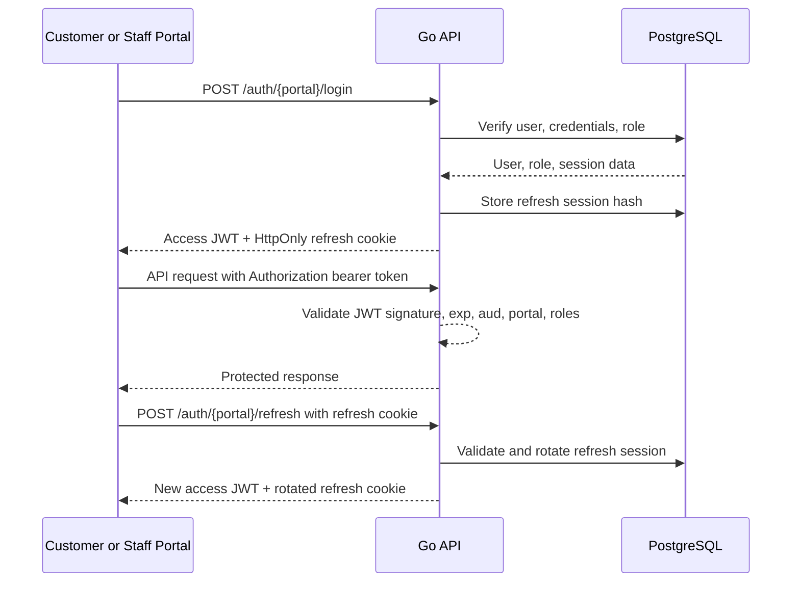

# ADR-0001: Authentication Session Architecture

**Status:** Accepted
**Date:** 2026-04-30
**Last Updated:** 2026-04-30
**Author:** adr-author
**Reviewers:** Not required for this project workflow

---

## Table of Contents

1. Context
2. Scope
3. Constraints
4. Options Considered
5. Decision
6. Authentication Design
7. Token and Session Model
8. Browser Storage and Portal Boundaries
9. Consequences
10. Open Questions
11. Decision Log

---

## 1. Context

The online shop API needs an authentication and authorization foundation before customer-specific and staff-specific workflows can safely be added. The system has one Go API, a PostgreSQL database, a planned Next.js customer portal, and a planned React staff portal. Both portals must share identity data while keeping customer and staff sessions separate.

The MVP intentionally avoids becoming a full identity platform. It must support credentials-based customer registration, credentials-based staff login for manually bootstrapped staff users, role-based access checks, and secure session continuation. Future capabilities such as Google login, account linking, email verification, password reset, fine-grained permissions, staff self-management, MFA, and immediate JWT revocation are deferred.

A deliberate session architecture decision is required because auth choices have long-lived security and operational consequences. The design must balance MVP simplicity with a path toward stronger authorization later.

---

## 2. Scope

**In scope:**

- Authentication ownership for the MVP.
- Access token strategy.
- Refresh token strategy.
- Customer and staff portal session separation.
- Role claims in access tokens.
- JWT signing algorithm for MVP.
- Browser token storage rules.
- Revocation boundary for MVP logout.

**Out of scope (addressed elsewhere or deferred):**

- Google OAuth login.
- Account linking.
- Email verification.
- Password reset.
- Staff account creation and setup links.
- Fine-grained permissions.
- MFA.
- Redis-backed JWT blacklist.
- Multi-service token verification.

---

## 3. Constraints

- Authentication must be owned by the existing Go API.
- The API must support a Next.js customer portal and a React staff portal on separate subdomains that call the API on another subdomain.
- User email addresses must be globally unique.
- Customer and staff sessions must be separate.
- Staff authentication must be credentials-only in the MVP.
- Access tokens must use HS256 for MVP.
- Refresh tokens must not be stored raw.
- Access token revocation via Redis or a denylist is out of scope for MVP.

---

## 4. Options Considered

### Option A — Go-Owned JWT Access Tokens with Stored Rotating Refresh Sessions ✅ Selected

The Go API issues short-lived JWT access tokens and stores hashed opaque refresh sessions in PostgreSQL. Portals keep access tokens in memory and receive refresh tokens through Secure HttpOnly cookies.

| Aspect                 | Assessment                                                    |
| ---------------------- | ------------------------------------------------------------- |
| Portal fit             | Works for both Next.js customer portal and React staff portal |
| API authorization      | Fast normal route checks using JWT claims                     |
| Logout control         | Refresh session can be revoked in PostgreSQL                  |
| Replay protection      | Refresh token rotation plus previous-token reuse detection    |
| Operational complexity | No Redis or external identity runtime required                |

Selected because it satisfies the MVP requirements while preserving server control over long-lived sessions.

### Option B — Opaque Server Sessions for Every Request ❌ Rejected

Every API request would carry an opaque session token that the API validates against server-side storage.

| Aspect               | Assessment                                                                      |
| -------------------- | ------------------------------------------------------------------------------- |
| Immediate revocation | Stronger than JWT access tokens                                                 |
| Request overhead     | Requires database or cache lookup on every authenticated request                |
| MVP complexity       | Higher for normal protected reads                                               |
| Portal fit           | Works, but provides less value while no high-risk staff mutation surface exists |

Rejected because the MVP does not require immediate access-token revocation and can use short-lived JWTs for simpler request authorization.

### Option C — JWT-Only Sessions ❌ Rejected

The API would issue long-lived JWTs without stored refresh sessions.

| Aspect               | Assessment                                             |
| -------------------- | ------------------------------------------------------ |
| Simplicity           | Simple initial implementation                          |
| Logout control       | Weak because there is no server-side session to revoke |
| Token theft response | Weak without a denylist or key rotation                |
| MVP security         | Insufficient for staff portal authentication           |

Rejected because the API needs server-side control over session continuation and logout.

### Option D — Redis-Backed JWT Blacklist ❌ Rejected for MVP

The API would store logged-out or revoked access token identifiers in Redis and check them on requests.

| Aspect               | Assessment                                                                               |
| -------------------- | ---------------------------------------------------------------------------------------- |
| Immediate revocation | Stronger access-token logout semantics                                                   |
| Infrastructure       | Adds Redis, config, health checks, and failure modes                                     |
| MVP need             | Low because staff access tokens expire in 5 minutes and staff mutations are out of scope |
| Future fit           | Useful when high-risk staff operations or compliance requirements appear                 |

Rejected for MVP because it adds infrastructure before the risk profile justifies it.

### Option E — Next.js or Better Auth Owns Authentication ❌ Rejected

Authentication would be delegated to a Next.js runtime or a Node-based auth library.

| Aspect              | Assessment                                                       |
| ------------------- | ---------------------------------------------------------------- |
| Customer portal fit | Strong if all auth lived in Next.js                              |
| Staff portal fit    | Weaker because staff portal is React and not necessarily Next.js |
| API authorization   | Requires cross-runtime trust or session validation integration   |
| Ownership           | Splits identity behavior away from protected Go API endpoints    |

Rejected because both portals need the same identity system and the Go API should enforce authorization close to protected resources.

---

## 5. Decision

Use Go-owned JWT access tokens with PostgreSQL-backed rotating refresh sessions for MVP authentication.

Use separate customer and staff portal sessions, store refresh tokens only as hashes, keep access tokens memory-only in portal apps, include roles in access JWT claims, sign MVP access tokens with HS256, and defer Redis-backed access-token blacklisting.

---

## 6. Authentication Design



The Go API is the only authority that issues access tokens and refresh sessions. Authentication endpoints verify credentials and role membership before issuing a portal-specific session. Normal protected endpoints authorize using validated access token claims.

---

## 7. Token and Session Model

Access JWTs contain the minimum claims needed for MVP route authorization:

```json
{
  "sub": "user_uuidv7",
  "sid": "session_uuidv7",
  "portal": "customer",
  "roles": ["customer"],
  "jti": "access_token_uuidv7",
  "iss": "online-shop-api",
  "aud": "customer-portal",
  "iat": 0,
  "exp": 0
}
```

Customer access tokens expire after 15 minutes. Staff access tokens expire after 5 minutes. Role claims can be stale until token expiry; that tradeoff is accepted for MVP because staff management and fine-grained permissions are out of scope.

Refresh sessions are stored in PostgreSQL with an opaque refresh token hash, portal, expiry, revocation state, and previous-token hash. On every refresh, the API rotates the refresh token using an atomic database update guarded by the current refresh token hash. If the previous token is reused, the API revokes only that refresh session for MVP and requires login again.

The access token `jti` claim is included for traceability and future denylist support only. It is not validated against server-side storage in the MVP because Redis-backed access-token blacklisting is deferred.

---

## 8. Browser Storage and Portal Boundaries

Refresh tokens are stored in Secure HttpOnly cookies. Access tokens are returned in JSON responses and kept in portal application memory only.

Customer and staff portal sessions use separate cookie names:

| Portal   | Refresh Cookie           | Cookie Path      | Audience          | Access Token TTL |
| -------- | ------------------------ | ---------------- | ----------------- | ---------------- |
| Customer | `customer_refresh_token` | `/auth/customer` | `customer-portal` | 15 minutes       |
| Staff    | `staff_refresh_token`    | `/auth/staff`    | `staff-portal`    | 5 minutes        |

The API must configure CORS with credentials for explicit customer and staff portal origins. Wildcard CORS with credentials is not allowed.

Refresh cookies default to host-only API cookies with `SameSite=Strict`, `Secure`, `HttpOnly`, and `Max-Age` derived from the refresh session TTL. Host-only cookies work for the intended same-site subdomain deployment because portal apps send refresh/logout requests to the API host, and the browser attaches the API-scoped cookie to those API requests.

---

## 9. Consequences

### Positive

- Keeps authentication and authorization enforcement inside the Go API.
- Supports both planned portals without a separate Node identity runtime.
- Preserves server-side control over long-lived sessions.
- Avoids storing raw refresh tokens.
- Keeps normal route authorization fast and simple.
- Provides a clear future path to stronger revocation and fine-grained permissions.

### Negative / Tradeoffs Accepted

- Access tokens can remain valid until expiry after logout.
- Role claims can be stale until token refresh or expiry.
- HS256 requires careful secret handling because verifiers can also mint tokens.
- Refresh cookie and CORS behavior must be configured carefully across subdomains.
- The team owns password/session/JWT implementation details instead of delegating to an identity library.

---

## 10. Open Questions

No open questions at time of writing.

---

## 11. Decision Log

| Date       | Decision                                                   | Rationale                                                                       |
| ---------- | ---------------------------------------------------------- | ------------------------------------------------------------------------------- |
| 2026-04-30 | Go API owns authentication and authorization enforcement   | Keeps identity and protected API authorization in one service for both portals. |
| 2026-04-30 | Use JWT access tokens with stored refresh sessions         | Balances fast authorization with server-controlled session continuation.        |
| 2026-04-30 | Rotate hashed opaque refresh tokens                        | Avoids raw token storage and detects common refresh replay.                     |
| 2026-04-30 | Use separate customer and staff portal sessions            | Prevents cookie/session collision and enforces portal boundaries.               |
| 2026-04-30 | Include roles in access JWT claims                         | Simplifies MVP route authorization with bounded staleness.                      |
| 2026-04-30 | Use HS256 for MVP                                          | Single Go API service does not need asymmetric verification yet.                |
| 2026-04-30 | Defer Redis/JWT blacklist                                  | Short token TTLs are sufficient for MVP and avoid extra infrastructure.         |
| 2026-04-30 | Use host-only, path-scoped refresh cookies by default      | Limits where refresh cookies are sent while still supporting same-site portals. |
| 2026-04-30 | Use HttpOnly refresh cookies and memory-only access tokens | Reduces browser token exposure while supporting portal refresh flows.           |
