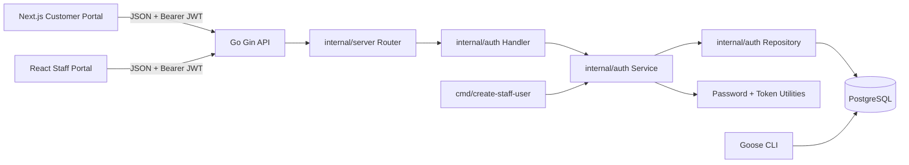

# Technical Spec: Authentication Baseline

**Feature ID:** F-0001
**Status:** Accepted
**Author:** tech-lead
**Date:** 2026-04-30
**Depends On:** ADR-0001, ADR-0002

---

## 1. Overview

Build the authentication baseline inside the existing Go/Gin API. The implementation adds a SQL-first Goose migration set, credentials-only customer registration and login, credentials-only staff login for manually created staff users, current-session refresh and logout, a shared `/me` endpoint, and basic auth endpoint rate limiting. This directly addresses US-001 through US-010.

The API issues short-lived HS256 access JWTs and stores hashed rotating refresh sessions in PostgreSQL, as accepted in ADR-0001. Customer and staff sessions are separate by portal, with separate endpoint groups and refresh cookie names. Staff bootstrap uses a temporary versioned CLI command, `cmd/create-staff-user`, as accepted in ADR-0002.

The feature deliberately avoids Google OAuth, email verification, password reset, staff self-management, profiles, permissions, MFA, logout-all, and Redis token blacklisting. The design keeps table and service boundaries compatible with those future features without implementing them in this slice.

---

## 2. Architecture



The router owns HTTP middleware and route registration. The auth handler owns request/response mapping. The auth service owns business rules, token issuance, and transaction orchestration. The auth repository owns SQL queries and transaction helpers against `pgxpool`.

Access tokens are sent by portal apps as `Authorization: Bearer ...`. Refresh tokens are never exposed to JavaScript; they are set as Secure HttpOnly cookies scoped by portal endpoint path. The API enables credentialed CORS only for configured customer and staff origins.

---

## 3. Components

### AuthConfig

**Type:** Configuration  
**Responsibility:** Parse and validate grouped authentication and CORS environment variables.  
**Location:** `internal/config/config.go`

**Interface:**

- Input: OS environment variables and optional `.env` file.
- Output: `config.Config` with nested `Auth config.AuthConfig`.
- Side effects: None.

Required fields:

- `APP_ENV`
- `AUTH_JWT_SECRET`
- `AUTH_CUSTOMER_PORTAL_ORIGIN`
- `AUTH_STAFF_PORTAL_ORIGIN`

Optional fields with defaults:

- `AUTH_ACCESS_TOKEN_TTL_CUSTOMER=15m`
- `AUTH_ACCESS_TOKEN_TTL_STAFF=5m`
- `AUTH_REFRESH_TOKEN_TTL=720h`
- `AUTH_COOKIE_DOMAIN=""`
- `AUTH_COOKIE_SECURE=true`
- `AUTH_COOKIE_SAME_SITE=strict`
- `AUTH_JWT_CLOCK_SKEW=10s`
- `AUTH_RATE_LIMIT_WINDOW=1m`
- `AUTH_RATE_LIMIT_CUSTOMER_LOGIN=10`
- `AUTH_RATE_LIMIT_STAFF_LOGIN=5`
- `AUTH_RATE_LIMIT_CUSTOMER_REGISTER=5`
- `DATABASE_MAX_CONNS=10`
- `DATABASE_MIN_CONNS=1`
- `DATABASE_MAX_CONN_LIFETIME=1h`
- `DATABASE_MAX_CONN_IDLE_TIME=15m`

`AUTH_JWT_SECRET` must be supplied as base64url without padding and decode to at least 32 bytes. The application must decode and validate the byte length at startup; do not treat the encoded string length as the secret entropy.

`AUTH_COOKIE_DOMAIN=""` intentionally creates host-only refresh cookies for the API host. This is the preferred MVP default because portal apps call the API host for refresh/logout, so a cookie scoped to `api.example.com` is sent correctly without being exposed to sibling subdomains. Only set `AUTH_COOKIE_DOMAIN` when multiple API hostnames must share the same refresh cookie.

`AUTH_COOKIE_SAME_SITE=strict` is valid for the intended same parent-domain deployment, such as `customer.example.com`, `staff.example.com`, and `api.example.com`, because SameSite is evaluated by site, not by origin. If any portal is deployed on a different registrable domain from the API, this MVP cookie design must be revisited with explicit CSRF protection before using `SameSite=None; Secure`.

### AuthHandler

**Type:** HTTP handler  
**Responsibility:** Bind JSON requests, invoke auth service methods, set/clear refresh cookies, and return JSON responses.  
**Location:** `internal/auth/handler.go`

**Interface:**

- Input: `*gin.Context`.
- Output: JSON responses documented in API Contracts.
- Side effects: Writes customer or staff refresh cookies.

Refresh cookie attributes:

| Portal   | Cookie Name              | Path             | Max-Age                          | HttpOnly | Secure               | SameSite                | Domain               |
| -------- | ------------------------ | ---------------- | -------------------------------- | -------- | -------------------- | ----------------------- | -------------------- |
| Customer | `customer_refresh_token` | `/auth/customer` | `AUTH_REFRESH_TOKEN_TTL` seconds | Yes      | `AUTH_COOKIE_SECURE` | `AUTH_COOKIE_SAME_SITE` | `AUTH_COOKIE_DOMAIN` |
| Staff    | `staff_refresh_token`    | `/auth/staff`    | `AUTH_REFRESH_TOKEN_TTL` seconds | Yes      | `AUTH_COOKIE_SECURE` | `AUTH_COOKIE_SAME_SITE` | `AUTH_COOKIE_DOMAIN` |

Use `Max-Age` derived from the configured refresh TTL for set and clear operations. Do not rely on `Expires` as the primary expiry control.

`SameSite=Strict` is the MVP CSRF control for refresh and logout endpoints that authenticate through HttpOnly cookies. Do not loosen this to `None` without adding an explicit CSRF token or equivalent protection.

### AuthService

**Type:** Service  
**Responsibility:** Implement registration, login, refresh, logout, `/me` identity lookup, and staff-user creation for the bootstrap command.  
**Location:** `internal/auth/service.go`

**Interface:**

- Input: typed command structs such as `RegisterCustomerInput`, `LoginInput`, `RefreshInput`, `CreateStaffUserInput`.
- Output: typed result structs such as `AuthResult`, `CurrentUser`, `CreatedStaffUser`.
- Side effects: Creates users/accounts/sessions, rotates refresh tokens, revokes sessions.

### AuthRepository

**Type:** Repository  
**Responsibility:** Encapsulate PostgreSQL reads/writes for users, accounts, roles, user roles, and sessions.  
**Location:** `internal/auth/repository.go`

**Interface:**

- Input: `context.Context`, optional `pgx.Tx`, and typed query parameters.
- Output: domain records and errors.
- Side effects: Database mutations inside explicit transactions.

### PasswordHasher

**Type:** Utility  
**Responsibility:** Hash and verify credentials passwords with Argon2id.  
**Location:** `internal/auth/password.go`

**Interface:**

- Input: plaintext password or encoded hash.
- Output: encoded Argon2id hash or verification result.
- Side effects: Generates cryptographic salt.

Argon2id parameters:

- memory: 19456 KiB
- iterations: 2
- parallelism: 1
- salt length: 16 bytes
- key length: 32 bytes

The encoded hash string must include the algorithm, version, parameters, salt, and derived key so future parameter upgrades remain verifiable. These parameters follow OWASP's current Argon2id minimum recommendation.

Login verification must use a dummy encoded Argon2id hash when no credentials account exists, so nonexistent users still perform password verification work before returning the generic login failure.

### TokenManager

**Type:** Utility  
**Responsibility:** Issue and validate HS256 access JWTs and generate/hash opaque refresh tokens.  
**Location:** `internal/auth/tokens.go`

**Interface:**

- Input: user ID, session ID, portal, roles, TTL, JWT secret.
- Output: signed access token, refresh token raw value, refresh token hash.
- Side effects: Generates cryptographic random values.

JWT validation must use the configured `AUTH_JWT_CLOCK_SKEW` as leeway. The default leeway is 10 seconds.

Refresh tokens must be generated with `crypto/rand` and contain at least 32 random bytes before encoding. Store only the SHA-256 hex hash in PostgreSQL.

### AuthMiddleware

**Type:** Gin middleware  
**Responsibility:** Validate Bearer access JWTs and attach authenticated claims to request context.  
**Location:** `internal/auth/middleware.go`

**Interface:**

- Input: `Authorization` header and expected route audience.
- Output: authenticated principal in Gin context.
- Side effects: Aborts request with `401` on invalid token or audience mismatch.

JWT validation must explicitly allow only HS256 and reject every other algorithm, including `none`. Middleware must enforce both the `aud` claim (`customer-portal` or `staff-portal`) and the `portal` claim against the route group.

### CORS Middleware

**Type:** Gin middleware  
**Responsibility:** Allow credentialed browser requests only from configured customer and staff origins.  
**Location:** `internal/server/router.go`

**Interface:**

- Input: request `Origin`, route group, method, and headers.
- Output: CORS response headers.
- Side effects: Handles preflight responses.

Customer auth routes must allow only `AUTH_CUSTOMER_PORTAL_ORIGIN`. Staff auth routes must allow only `AUTH_STAFF_PORTAL_ORIGIN`. Shared routes such as `/me` may allow both configured origins.

### AuthRateLimiter

**Type:** Middleware / service helper
**Responsibility:** Apply basic per-instance rate limits to public authentication endpoints.
**Location:** `internal/auth/ratelimit.go`

**Interface:**

- Input: request IP, normalized email where present, route category, configured window and limit.
- Output: allow or reject decision.
- Side effects: Maintains in-memory counters for the current API instance.

Rate limit keys:

- customer login: `customer_login:{client_ip}:{normalized_email}`
- staff login: `staff_login:{client_ip}:{normalized_email}`
- customer registration: `customer_register:{client_ip}`

This is MVP brute-force protection only. Distributed, cross-instance, and risk-based rate limiting are out of scope.

### Auth Migrations

**Type:** SQL migrations  
**Responsibility:** Create auth schema and seed system roles.  
**Location:** `migrations/`

**Interface:**

- Input: Goose CLI execution.
- Output: PostgreSQL schema.
- Side effects: Creates `citext` extension, auth tables, indexes, and seed role rows.

### CreateStaffUserCommand

**Type:** CLI command  
**Responsibility:** Create a staff credentials user without exposing an HTTP bootstrap endpoint.  
**Location:** `cmd/create-staff-user/main.go`

**Interface:**

- Input: flags `--email`, `--name`, optional `--confirm-production`, `DATABASE_URL`, `APP_ENV`.
- Output: operator-facing success/failure message.
- Side effects: Creates one staff user through shared auth service logic.

---

## 4. API Contracts

All JSON error responses use this shape:

```json
{
  "error": {
    "code": "string",
    "message": "string"
  }
}
```

All successful JSON responses use this shape:

```json
{
  "data": {}
}
```

`204` responses have an empty body.

Generic credentials failure message:

```text
Invalid email or password.
```

Machine-readable error codes are limited to this MVP set:

| Code                  | Meaning                                                |
| --------------------- | ------------------------------------------------------ |
| `invalid_request`     | Request body, content type, or field validation failed |
| `invalid_credentials` | Login failed for any safe generic credentials reason   |
| `unauthorized`        | Missing, expired, malformed, or invalid auth token     |
| `email_conflict`      | Registration or bootstrap email already exists         |
| `rate_limited`        | Configured auth rate limit exceeded                    |
| `internal_error`      | Unexpected server error                                |

Portal apps may branch on `email_conflict` and `rate_limited`. They must not infer which login failure condition occurred from `invalid_credentials`.

### POST /auth/customer/register

**Purpose:** Register a customer credentials account.  
**Auth required:** No
**Content-Type:** `application/json`

**Request:**

```json
{
  "email": "string — required, valid email, globally unique",
  "password": "string — required, 8 to 128 characters, no leading or trailing whitespace",
  "name": "string — required, 1 to 120 characters after trimming"
}
```

**Response 201:**

```json
{
  "data": {
    "user": {
      "id": "uuid — user ID",
      "email": "string",
      "name": "string",
      "status": "active",
      "roles": ["customer"]
    }
  }
}
```

**Error responses:**

| Status | Condition                                         |
| ------ | ------------------------------------------------- |
| 400    | Invalid email, name, or password policy violation |
| 409    | Email already belongs to any user                 |
| 429    | Registration rate limit exceeded                  |
| 500    | Unexpected server error                           |

### POST /auth/customer/login

**Purpose:** Create a customer portal session with credentials.  
**Auth required:** No
**Content-Type:** `application/json`

**Request:**

```json
{
  "email": "string — required",
  "password": "string — required"
}
```

**Response 200:**

```json
{
  "data": {
    "access_token": "string — HS256 JWT",
    "token_type": "Bearer",
    "expires_in": "number — configured customer access token TTL in seconds",
    "user": {
      "id": "uuid",
      "email": "string",
      "name": "string",
      "status": "active",
      "roles": ["customer"]
    }
  }
}
```

**Cookie side effect:** Set `customer_refresh_token`.

**Error responses:**

| Status | Condition                                                    |
| ------ | ------------------------------------------------------------ |
| 400    | Malformed request                                            |
| 401    | Invalid credentials, inactive user, or missing customer role |
| 429    | Customer login rate limit exceeded                           |
| 500    | Unexpected server error                                      |

### POST /auth/customer/refresh

**Purpose:** Rotate customer refresh token and issue a new customer access token.  
**Auth required:** Customer refresh cookie

**Request:** No body. The handler must not read request body fields for refresh behavior.

**Response 200:**

```json
{
  "data": {
    "access_token": "string — HS256 JWT",
    "token_type": "Bearer",
    "expires_in": "number — configured customer access token TTL in seconds"
  }
}
```

**Cookie side effect:** Replace `customer_refresh_token` with rotated token.

**Error responses:**

| Status | Condition                                                   |
| ------ | ----------------------------------------------------------- |
| 401    | Missing, invalid, expired, revoked, or reused refresh token |
| 500    | Unexpected server error                                     |

### POST /auth/customer/logout

**Purpose:** Revoke the current customer refresh session.  
**Auth required:** Customer refresh cookie

**Request:** No body.

**Response 204:** Empty body.

**Cookie side effect:** Clear `customer_refresh_token`.

**Error responses:**

| Status | Condition               |
| ------ | ----------------------- |
| 500    | Unexpected server error |

Logout is idempotent. Missing or already revoked refresh cookies still return `204`.

### POST /auth/staff/login

**Purpose:** Create a staff portal session with credentials.  
**Auth required:** No
**Content-Type:** `application/json`

**Request:**

```json
{
  "email": "string — required",
  "password": "string — required"
}
```

**Response 200:**

```json
{
  "data": {
    "access_token": "string — HS256 JWT",
    "token_type": "Bearer",
    "expires_in": "number — configured staff access token TTL in seconds",
    "user": {
      "id": "uuid",
      "email": "string",
      "name": "string",
      "status": "active",
      "roles": ["staff"]
    }
  }
}
```

**Cookie side effect:** Set `staff_refresh_token`.

**Error responses:**

| Status | Condition                                                 |
| ------ | --------------------------------------------------------- |
| 400    | Malformed request                                         |
| 401    | Invalid credentials, inactive user, or missing staff role |
| 429    | Staff login rate limit exceeded                           |
| 500    | Unexpected server error                                   |

### POST /auth/staff/refresh

**Purpose:** Rotate staff refresh token and issue a new staff access token.  
**Auth required:** Staff refresh cookie

**Request:** No body. The handler must not read request body fields for refresh behavior.

**Response 200:**

```json
{
  "data": {
    "access_token": "string — HS256 JWT",
    "token_type": "Bearer",
    "expires_in": "number — configured staff access token TTL in seconds"
  }
}
```

**Cookie side effect:** Replace `staff_refresh_token` with rotated token.

**Error responses:**

| Status | Condition                                                   |
| ------ | ----------------------------------------------------------- |
| 401    | Missing, invalid, expired, revoked, or reused refresh token |
| 500    | Unexpected server error                                     |

### POST /auth/staff/logout

**Purpose:** Revoke the current staff refresh session.  
**Auth required:** Staff refresh cookie

**Request:** No body.

**Response 204:** Empty body.

**Cookie side effect:** Clear `staff_refresh_token`.

**Error responses:**

| Status | Condition               |
| ------ | ----------------------- |
| 500    | Unexpected server error |

Logout is idempotent. Missing or already revoked refresh cookies still return `204`.

### GET /me

**Purpose:** Return current authenticated identity for either portal.  
**Auth required:** Bearer access token
**Router group:** Register as root-level `GET /me`, outside `/auth/customer` and `/auth/staff`.

**Request:** No body.

**Response 200:**

```json
{
  "data": {
    "user": {
      "id": "uuid",
      "email": "string",
      "name": "string",
      "status": "active",
      "roles": ["customer"]
    },
    "session": {
      "id": "uuid",
      "portal": "customer"
    }
  }
}
```

**Error responses:**

| Status | Condition                                            |
| ------ | ---------------------------------------------------- |
| 401    | Missing, expired, malformed, or invalid access token |
| 500    | Unexpected server error                              |

`/me` must load the current user and roles from PostgreSQL. Returned roles reflect current database assignments, not only JWT role claims. This means `/me` can show role changes before the existing access token expires, while ordinary route authorization remains bounded by access token expiry.

---

## 5. Data Models

Use UUIDv7 generated by Go application code for all primary keys. Use `timestamptz` for all timestamps. Use `citext` for globally unique case-insensitive email addresses.

### users

| Field      | Type        | Nullable | Description                   |
| ---------- | ----------- | -------- | ----------------------------- |
| id         | uuid        | No       | UUIDv7 primary key            |
| email      | citext      | No       | Globally unique email address |
| name       | text        | No       | Display name                  |
| status     | text        | No       | `active` or `disabled`        |
| created_at | timestamptz | No       | Creation timestamp            |
| updated_at | timestamptz | No       | Last update timestamp         |

**Indexes:** unique index on `email`.  
**Constraints:** `status in ('active', 'disabled')`; non-empty `name`.

### accounts

| Field               | Type        | Nullable | Description                         |
| ------------------- | ----------- | -------- | ----------------------------------- |
| id                  | uuid        | No       | UUIDv7 primary key                  |
| user_id             | uuid        | No       | References `users(id)`              |
| provider            | text        | No       | MVP value is `credentials`          |
| provider_account_id | text        | No       | For credentials, `users.id` as text |
| password_hash       | text        | No       | Encoded Argon2id password hash      |
| created_at          | timestamptz | No       | Creation timestamp                  |
| updated_at          | timestamptz | No       | Last update timestamp               |

**Indexes:** `accounts_user_id_idx`; unique `(provider, provider_account_id)`; unique `(user_id, provider)`.  
**Foreign keys:** `user_id references users(id) on delete cascade`.
**Constraints:** Database-level check `provider in ('credentials')` for this MVP. The future OAuth feature must include a migration that widens this check before inserting non-credentials accounts. It must also either make `password_hash` nullable for non-credentials accounts or split credential passwords into a provider-specific table.

### sessions

| Field                       | Type        | Nullable | Description                                            |
| --------------------------- | ----------- | -------- | ------------------------------------------------------ |
| id                          | uuid        | No       | UUIDv7 primary key                                     |
| user_id                     | uuid        | No       | References `users(id)`                                 |
| portal                      | text        | No       | `customer` or `staff`                                  |
| refresh_token_hash          | text        | No       | SHA-256 hex hash of current refresh token              |
| previous_refresh_token_hash | text        | Yes      | SHA-256 hex hash of immediately previous refresh token |
| rotated_at                  | timestamptz | Yes      | Last successful rotation timestamp                     |
| expires_at                  | timestamptz | No       | Refresh session expiry                                 |
| revoked_at                  | timestamptz | Yes      | Revocation timestamp                                   |
| ip_address                  | inet        | Yes      | Request IP captured at session creation                |
| user_agent                  | text        | Yes      | Request user agent captured at session creation        |
| created_at                  | timestamptz | No       | Creation timestamp                                     |
| updated_at                  | timestamptz | No       | Last update timestamp                                  |

**Indexes:** `sessions_user_id_idx`; `sessions_expires_at_idx`; unique `refresh_token_hash`; unique `previous_refresh_token_hash`. PostgreSQL allows multiple `NULL` values in a unique index, so sessions that have not rotated yet can all have `previous_refresh_token_hash = NULL`.
**Foreign keys:** `user_id references users(id) on delete cascade`.
**Constraints:** `portal in ('customer', 'staff')`; `expires_at > created_at`.

### roles

| Field       | Type        | Nullable | Description                    |
| ----------- | ----------- | -------- | ------------------------------ |
| id          | uuid        | No       | UUIDv7 primary key             |
| code        | text        | No       | Immutable role code            |
| name        | text        | No       | Human-readable role name       |
| description | text        | Yes      | Role description               |
| system      | boolean     | No       | Whether role is system-managed |
| created_at  | timestamptz | No       | Creation timestamp             |
| updated_at  | timestamptz | No       | Last update timestamp          |

**Indexes:** unique `code`.  
**Constraints:** `code in ('customer', 'staff')` for this MVP.

Seed rows:

| code     | name     | system |
| -------- | -------- | ------ |
| customer | Customer | true   |
| staff    | Staff    | true   |

### user_roles

| Field              | Type        | Nullable | Description                                                              |
| ------------------ | ----------- | -------- | ------------------------------------------------------------------------ |
| user_id            | uuid        | No       | References `users(id)`                                                   |
| role_id            | uuid        | No       | References `roles(id)`                                                   |
| granted_by_user_id | uuid        | Yes      | References `users(id)`; null for customer registration and CLI bootstrap |
| created_at         | timestamptz | No       | Assignment timestamp                                                     |

**Indexes:** `user_roles_role_id_idx`.  
**Foreign keys:** `user_id references users(id) on delete cascade`; `role_id references roles(id) on delete restrict`; `granted_by_user_id references users(id) on delete set null`.
**Constraints:** primary key `(user_id, role_id)`.

Role revocation is out of scope for this feature. `user_roles` records may be hard-deleted by a future feature, but that feature must define revocation audit requirements before adding role removal workflows.

### updated_at Maintenance

All tables with `updated_at` use application-maintained timestamps in MVP. Every insert sets `created_at` and `updated_at` to the same application timestamp. Every update explicitly sets `updated_at = now` in the repository method performing the mutation. Do not add PostgreSQL triggers for this feature.

### AccessTokenClaims

| Field  | Type         | Nullable | Description                                                            |
| ------ | ------------ | -------- | ---------------------------------------------------------------------- |
| sub    | string       | No       | User UUIDv7                                                            |
| sid    | string       | No       | Session UUIDv7                                                         |
| portal | string       | No       | `customer` or `staff`                                                  |
| roles  | string array | No       | Role codes assigned at issuance                                        |
| jti    | string       | No       | Access token UUIDv7 for traceability only; not server-validated in MVP |
| iss    | string       | No       | `online-shop-api`                                                      |
| aud    | string       | No       | `customer-portal` or `staff-portal`                                    |
| iat    | number       | No       | Issued-at Unix timestamp                                               |
| exp    | number       | No       | Expiry Unix timestamp                                                  |

---

## 6. Key Design Decisions

| Decision                                             | Rationale                                                                                                                                     |
| ---------------------------------------------------- | --------------------------------------------------------------------------------------------------------------------------------------------- |
| Use `citext` for `users.email`                       | Enforces global case-insensitive uniqueness in PostgreSQL instead of relying only on application normalization.                               |
| Restrict `accounts.provider` to `credentials` in MVP | Google and account linking are explicit non-goals; the table can be altered when OAuth is implemented.                                        |
| Keep `email_verified_at` out of `users` for MVP      | Email verification is out of scope, and adding the column later is straightforward.                                                           |
| Use `active` and `disabled` user statuses only       | Staff setup links and pending users are out of scope, so `pending` is not needed yet.                                                         |
| Make logout idempotent                               | Browser and network retries should not turn logout into an error-prone operation.                                                             |
| Use SHA-256 hashes for refresh token lookup          | Refresh tokens are high-entropy random values, so a keyed hash is not required for MVP lookup safety.                                         |
| Use shared service logic for `cmd/create-staff-user` | Keeps CLI behavior consistent with HTTP auth behavior and ADR-0002.                                                                           |
| Use timestamped Goose migration filenames            | Goose creates timestamped migrations by default, which avoids branch collision better than hand-authored sequence numbers during development. |
| Name the first migration `create_auth_baseline`      | Descriptive migration names stay useful in status output and review history after the project has many migrations.                            |
| Wrap successful JSON responses in `data`             | Gives the API a consistent response envelope while preserving empty bodies for `204` responses.                                               |
| Maintain `updated_at` in application code            | Keeps timestamp behavior explicit in repository methods and avoids trigger complexity in the first schema slice.                              |
| Use per-instance auth rate limiting                  | Provides basic MVP protection against brute force without adding Redis or distributed rate-limit infrastructure.                              |
| Treat JWT `jti` as traceability-only in MVP          | Access-token denylisting is out of scope, so `jti` is useful for logs and future blacklist support but is not a replay control.               |
| Use host-only API refresh cookies by default         | The browser sends these cookies to the API host on portal-initiated requests while avoiding broader sibling-subdomain cookie exposure.        |
| Reject password edge whitespace                      | Preserves the user's intended password exactly and avoids silently hashing a trimmed variant.                                                 |
| Require base64url-decoded JWT secret length          | Prevents confusing encoded string length with actual secret entropy.                                                                          |

Major architecture decisions are documented in ADR-0001 and ADR-0002.

---

## 7. Implementation Notes

1. Add dependencies:
   - `github.com/pressly/goose/v3` for migrations and test setup.
   - `github.com/golang-jwt/jwt/v5` for JWT signing/validation.
   - `github.com/google/uuid` for UUIDv7 generation.
   - `github.com/testcontainers/testcontainers-go` and PostgreSQL module for integration tests.
   - Use `golang.org/x/crypto/argon2` for password hashing.
2. Add `migrations/YYYYMMDDHHMMSS_create_auth_baseline.sql` using `goose -dir migrations create create_auth_baseline sql`:
   - enable `citext`
   - create `users`, `accounts`, `sessions`, `roles`, `user_roles`
   - include explicit foreign key `on delete` actions from the Data Models section
   - seed `customer` and `staff`
   - include a Goose down migration that drops these objects in reverse dependency order.
   - do not drop the `citext` extension in the down migration; later features may also depend on it.
3. Extend `internal/config`:
   - add `APP_ENV`
   - add nested `AuthConfig`
   - parse Go-style durations
   - require `AUTH_JWT_SECRET` to be base64url without padding and decode to at least 32 bytes
   - require exact portal origins
   - document `AUTH_COOKIE_SAME_SITE=strict` for same-site subdomain deployments
   - keep `AUTH_COOKIE_DOMAIN` empty by default for host-only API cookies
   - add environment-configurable `pgxpool` settings instead of hardcoding pool limits
   - update `.env.example`.
4. Add `internal/auth` package in this order:
   - domain types and constants
   - password hashing
   - token manager
   - repository
   - service
   - middleware
   - handler
5. Update `internal/server/router.go`:
   - accept auth config
   - add CORS middleware
   - register auth routes
   - keep `/healthz` and `/readyz` public.
6. Update `cmd/api/main.go` to construct auth repository/service/handler through `server.NewRouter`.
7. Add `cmd/create-staff-user`:
   - use shared config/database setup
   - parse `--email`, `--name`, `--confirm-production`
   - prompt password without echo
   - require typed email confirmation for production
   - call shared staff creation service method.
8. Add Make targets:
   - `migrate-up`
   - `migrate-down`
   - `migrate-status`
   - `migrate-create`
9. Add integration test support:
   - start `postgres:18-alpine` with Testcontainers
   - run Goose migrations
   - test repositories/services against real PostgreSQL under normal `go test ./...`.
10. Do not add Google, email, password reset, staff HTTP creation, profiles, permissions, MFA, logout-all, or Redis logic.

Known edge cases:

- Normalize email by trimming spaces and lowercasing before storage and lookup.
- Reject passwords with leading or trailing whitespace instead of trimming before hashing. This avoids silently changing the user's intended secret.
- Return generic login failure for invalid credentials, inactive users, missing credentials account, or missing portal role.
- Check user activity from `users.status`; `accounts` has no status field.
- Use the dummy Argon2id hash path when credentials are missing so nonexistent users do not return materially faster than wrong passwords.
- Generate refresh tokens only with `crypto/rand`; never use `math/rand` for auth tokens or salts.
- Do not log plaintext passwords, raw refresh tokens, full access JWTs, raw `Authorization` headers, or full auth request bodies.
- Use `AUTH_JWT_CLOCK_SKEW` when validating JWT `iat` and `exp`.
- Allow only HS256 during JWT parsing and reject `none` or any other algorithm before trusting claims.
- Enforce JWT `aud` and `portal` against the route group before allowing protected handlers to run.
- On refresh, rotate with a single atomic `UPDATE ... WHERE refresh_token_hash = $1 AND revoked_at IS NULL AND expires_at > now()` and check the affected row count. Do not implement rotation as a separate select-then-update path.
- On refresh, match current hash first; if previous hash matches, revoke only that session and reject.
- If the server commits a refresh rotation but the response is lost, the client's next refresh may present the previous token and revoke the session. This logout is an accepted security tradeoff for MVP.
- If neither the current nor previous refresh token hash matches any active session, return `401` with no database side effects.
- On logout, revoke only the current portal refresh session and clear only that portal cookie.
- Do not clear staff cookies from customer endpoints or customer cookies from staff endpoints.
- Do not store access tokens server-side.

---

## 8. Out of Scope

- Google OAuth login.
- Account linking across providers.
- Email verification.
- Password reset.
- Staff account creation from the staff portal.
- Staff password setup links.
- Email delivery.
- User profile tables or profile management.
- Fine-grained permissions and `role_permissions`.
- MFA.
- Logout-all-devices.
- Redis-backed JWT blacklist or immediate access-token revocation.
- Backdoor or maintenance HTTP endpoints for staff bootstrap.
- Automatic migrations during API startup.
- Distributed, cross-instance, or risk-based rate limiting.
- Role revocation workflows or role revocation audit history.

---

## 9. Open Questions

No open questions at time of writing.
